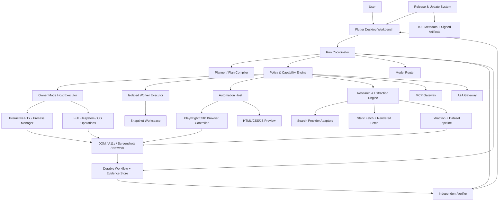
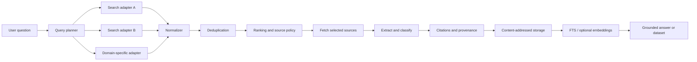
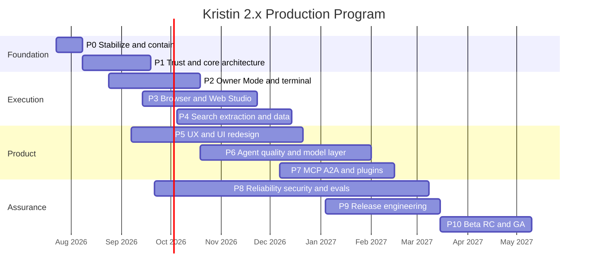
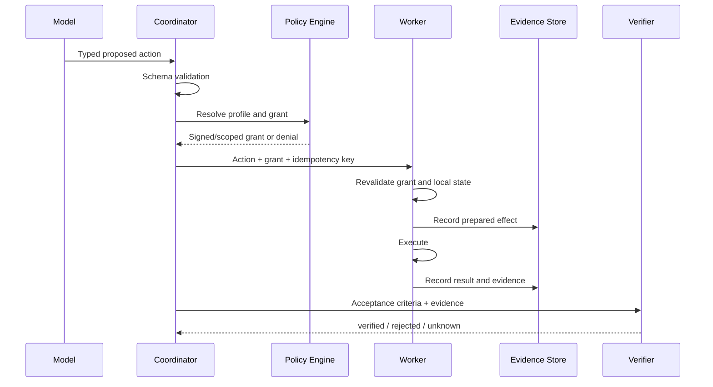

# Kristin 2.x Gold-Standard Production Roadmap

**Document type:** executable engineering roadmap and AI implementation manual
**Baseline reviewed:** Kristin Local Agent `v1.9.0+190`, `main` branch, July 23, 2026
**Target:** production-grade desktop AI agent with optional full-computer **Owner Mode**, interactive terminal, browser automation, HTML/CSS/JavaScript Web Studio, high-quality web research, extraction, durable data storage, modern UX/UI, signed releases, secure updates, and measurable agent quality
**Primary implementers:** ChatGPT and/or Claude operating against the repository, one bounded work packet at a time
**Human role:** product owner, credential holder, release authority, and final approver for identity, signing, legal, payment, MFA, and production-promotion actions
**Roadmap version:** `1.0.0`

> This document is intended to be committed into the repository as `docs/KRISTIN_GOLD_STANDARD_PRODUCTION_ROADMAP.md` and treated as the implementation source of truth. It is deliberately more specific than a normal roadmap: it defines architecture, task order, deliverables, tests, evidence, AI prompts, release gates, and operating rules.

---

## 0. Executive decision

Kristin should not merely become a desktop chatbot that can run commands. It should become an **evidence-governed computer operator and web workbench**:

```text
user goal
→ model-generated proposal
→ deterministic plan
→ configured access policy
→ terminal/browser/filesystem execution
→ observable evidence
→ independent verification
→ durable result, rollback, and audit
```

The product will support **full access to the computer** because the product owner explicitly accepts that operating model. Full access will be implemented as an explicit **Owner Mode** rather than as an accidental bypass hidden inside ordinary project tools.

Owner Mode may be configured to permit:

- access to any local file or directory available to the current OS account;
- absolute paths and arbitrary working directories;
- interactive terminal sessions and ordinary shell commands;
- installation and removal of packages, SDKs, applications, and services;
- process, service, environment, clipboard, screenshot, and application control;
- unrestricted outbound web access;
- browser login sessions, form completion, downloads, uploads, and web workflows;
- local HTML, CSS, JavaScript, Node, Python, Flutter, and other development workflows;
- persistent or unattended execution when the owner explicitly enables it;
- an approval policy of `always`, `high_risk_only`, or `never`.

Owner Mode is **not** described as a sandbox. If Kristin runs under an administrator or root account, its effects carry those privileges. The implementation must preserve a visible kill switch, process-tree termination, immutable audit records, best-effort snapshots, secret redaction, and crash recovery even when approvals are disabled. Those controls are operational reliability, not restrictions on the owner’s chosen authority.

The production product will still ship with safer profiles so other users are not forced into the same risk posture.

---

# 1. How to use this roadmap

## 1.1 One work packet per AI session

ChatGPT or Claude must execute one atomic roadmap item, or one explicitly defined bundle, per session. The implementing AI must not silently start the next item.

Every session follows this sequence:

1. Read this roadmap, `docs/roadmap/STATUS.md`, the relevant architecture decision records, and the files named by the task.
2. Inspect the current repository state before proposing edits.
3. State the exact task ID and acceptance criteria.
4. Create a small implementation plan.
5. Modify the minimum necessary files.
6. Add or update behavioral tests.
7. Run the targeted tests.
8. Run the repository’s required verification tier.
9. Record evidence under `release/evidence/<task-id>/`.
10. Update `docs/roadmap/STATUS.md`.
11. Produce a concise handoff containing changed files, commands, results, risks, and the next unblocked task.

## 1.2 Required roadmap control files

Create these during Phase 0:

```text
docs/
  roadmap/
    STATUS.md
    DECISIONS.md
    RISKS.md
    METRICS.md
    RELEASE_GATES.md
    HANDOFF.md
    prompts/
      implement.md
      review.md
      security-review.md
      release-review.md
      failure-recovery.md
  adr/
    ADR-0001-runtime-boundaries.md
    ADR-0002-owner-mode.md
    ADR-0003-signed-manifest-v2.md
    ADR-0004-automation-host.md
    ADR-0005-browser-storage.md
    ADR-0006-update-system.md
tasks/
  active/
  completed/
  blocked/
release/
  evidence/
  attestations/
  reports/
evals/
  fixtures/
  datasets/
  results/
```

`STATUS.md` is the authoritative execution ledger. GitHub issues or project boards may mirror it, but they must not become a second conflicting source of truth.

## 1.3 Status values

Use exactly:

```text
NOT_STARTED
READY
IN_PROGRESS
BLOCKED
REVIEW
DONE
DEFERRED
```

A task is `DONE` only when its listed tests and evidence exist. Source tokens, class names, screenshots, or an AI statement that the work is complete are not sufficient by themselves.

## 1.4 Definition of ready

A task is ready when:

- all dependencies are `DONE`;
- the relevant schema or ADR is approved;
- required tools are installed or a fixture substitutes for them;
- a deterministic test strategy is known;
- no unresolved architecture decision is hidden inside the implementation task.

## 1.5 Definition of done

Every code task must satisfy all applicable conditions:

- implementation compiles;
- new behavior has direct tests;
- negative behavior has tests;
- error paths have stable machine-readable codes;
- no generated artifacts are unintentionally committed;
- logs and diagnostics do not expose credentials;
- documentation matches the behavior;
- the task-specific evidence manifest records commit, commands, outputs, and hashes;
- a separate review pass has no unresolved critical or high finding;
- the task does not broaden another capability by accident.

---

# 2. Baseline: retain, repair, replace

## 2.1 Foundations to retain

The current source already contains valuable foundations:

- typed model decisions and tool contracts;
- schema generation and provider-envelope compatibility tests;
- a SQLite workflow authority with append-only events, WAL/FULL synchronization, idempotency, checkpoints, leases, compensation, backup, and crash tests;
- project-path normalization and generated-state filtering;
- a Linux namespace worker and broker concepts;
- Prompt Studio, task plans, acceptance criteria, and a compiler boundary;
- Project Manager, managed processes, diagnostics, and evidence;
- knowledge, memory admission, content-addressed storage, and citation concepts;
- release validation, SBOM generation, secret scanning, and deterministic packaging intent;
- MCP/A2A, audit, policy, and update concepts that can be migrated to a corrected protocol.

These components should be evolved, not discarded.

## 2.2 Immediate defects and contradictions to repair

The production program begins with the following blockers:

1. One v1.9 helper uses the same HMAC secret as “public” and “private” material, puts the secret into the untrusted envelope, and then verifies with that envelope-supplied value. It cannot establish signer identity.
2. Python, Dart, and schema layers do not expose one canonical signed-manifest format or one cryptographic model.
3. The visible CI workflow uses moving toolchain channels and must be made fully green before it can serve as release evidence.
4. The security policy identifies an older supported release and contradicts the newer source regarding sandbox and broker implementation.
5. A large portion of validation checks for source text rather than externally observable behavior.
6. Repository provenance starts from a large replacement commit and has no published signed release.
7. The A2A bridge launches an executable selected through environment JSON and only becomes isolated when a trusted outer worker already provides isolation.
8. The secret scanner is useful but limited to a fixed set of regular expressions, file extensions, and the current source tree.
9. Cross-platform OS isolation, native signing, notarization, authenticated update installation, and production operations are incomplete.
10. Browser automation, an interactive terminal, web extraction, dataset management, and the requested unified Web Studio are not yet first-class production subsystems.

## 2.3 Replace security theater with explicit modes

Do not preserve a project-only restriction and quietly add exceptions until it becomes meaningless. Define distinct policies and display the active policy in the UI.

| Mode | Filesystem | Terminal | Network | Browser | Approvals | Intended use |
|---|---|---|---|---|---|---|
| `chat` | none | none | model-provider only | none | none | conversation |
| `project` | registered project roots | governed finite commands | brokered | project/research profile | required by risk | normal coding |
| `owner` | all user-accessible paths | full interactive shell | unrestricted or configured | full browser | configurable | owner-controlled workstation |
| `owner_unattended` | all user-accessible paths | full | unrestricted or configured | full | may be `never` | scheduled/long-running automation |
| `isolated_untrusted` | disposable workspace | sandbox worker | brokered deny-by-default | disposable profile | policy driven | hostile repositories or content |

`owner` and `isolated_untrusted` solve different problems. Neither is a fallback for the other.

---

# 3. Product north star and measurable outcomes

## 3.1 User outcome

A user can ask Kristin to:

- understand or change any local project;
- inspect, create, edit, move, and organize files anywhere permitted by the active profile;
- open a real terminal and interact with long-running programs;
- install dependencies and SDKs;
- build and preview HTML/CSS/JavaScript applications;
- open a browser, observe the DOM and accessibility tree, click, type, select, upload, download, and complete multi-step web workflows;
- research current information across multiple search providers;
- fetch static or JavaScript-rendered pages;
- extract readable text, metadata, links, tables, lists, JSON-LD, code, and files;
- preserve raw evidence, citations, screenshots, DOM snapshots, and content hashes;
- turn research into versioned datasets and export JSONL, CSV, Markdown, SQLite, and optional Parquet;
- resume after a crash without blindly repeating uncertain effects;
- see exactly what the agent is doing and stop it immediately;
- receive a verified result rather than an unsupported model claim.

## 3.2 Production success metrics

The initial targets below are release criteria, not claims about the current product. Calibrate them after the first reproducible baseline.

| Area | Initial production target |
|---|---:|
| Unauthorized effects in release corpus | `0` |
| Open critical/high security findings | `0` |
| Task success on supported Tier-1 benchmark | `>= 90%` |
| Lowest supported task category | `>= 85%` |
| False successful completion | `< 0.5%` |
| Crash-free desktop sessions during RC | `>= 99.9%` |
| Local side-effect crash reconciliation | `100%` recovered or explicitly `unknown` |
| Owner kill-switch process-tree termination | `< 2 s` p95 |
| Browser action receipt latency, excluding navigation | `< 250 ms` p95 |
| Terminal input-to-render latency | `< 100 ms` p95 |
| Navigation and pane switching | `< 100 ms` p95 |
| Search result deduplication precision | `>= 98%` on fixture corpus |
| Extraction success for supported HTML fixtures | `>= 95%` |
| Citation-to-source span validity | `>= 99%` |
| Update success in beta | `>= 99.5%` |
| Automatic update rollback success | `100%` in injected-failure suite |
| Side effects linked to run, actor, policy, and evidence | `100%` |
| Keyboard-accessible primary product flows | `100%` |
| WCAG 2.2 AA applicable desktop/web surfaces | pass automated and manual checklist |

## 3.3 Gold-standard principles

1. The model proposes; deterministic software authorizes and records.
2. Full access is an explicit user policy, not an accidental bypass.
3. Every side effect has an identity, scope, result, and evidence trail.
4. A task executor does not certify its own success without independent checks.
5. Browser and terminal activity are first-class observable run events.
6. External content is untrusted data even when it looks like an instruction.
7. Crashes produce recovery or an explicit `unknown`, never silent duplication.
8. Search answers are grounded in fetched evidence, not snippets alone.
9. Raw evidence and extracted interpretations remain distinguishable.
10. User takeover is a normal state for MFA, CAPTCHA, consent, payment, and ambiguous UI.
11. Product claims are generated from passing evidence.
12. Release artifacts are signed, attested, install-tested, update-tested, and rollback-tested.
13. Accessibility, privacy, and support are release gates.
14. AI-generated code receives independent review, especially for trust, execution, browser, and update paths.
15. Unsupported capabilities fail honestly instead of producing simulated success.

---

# 4. Target product architecture



## 4.1 Runtime process model

Use process separation for failure containment and packaging clarity:

```text
Kristin Desktop (Flutter/Dart)
  ├─ durable database and policy decisions
  ├─ model routing and UI
  ├─ local authenticated IPC client
  ├─ Owner Executor
  │    ├─ full filesystem operations
  │    ├─ finite process execution
  │    └─ privileged-operation coordinator
  ├─ Automation Host
  │    ├─ interactive PTY
  │    ├─ Playwright browser control
  │    ├─ local web preview
  │    └─ DOM/network/console capture
  ├─ Research Worker
  │    ├─ search adapters
  │    ├─ safe HTTP fetch
  │    ├─ HTML extraction
  │    └─ dataset transforms
  └─ Isolated Worker
       ├─ disposable workspace
       ├─ restricted process execution
       └─ brokered network and secrets
```

A Phase 2 architecture spike decides whether PTY and browser capabilities share one TypeScript automation host or use separate native/Rust and Playwright workers. The decision must be based on packaging, startup, memory, native dependency, and cross-platform tests rather than preference.

## 4.2 Security boundaries

- Flutter UI is not a security boundary.
- Model output is not a security boundary.
- A tool schema validates shape but does not grant authority.
- Owner Mode authority comes from a persisted owner policy and the current OS account.
- Isolated mode authority comes from a scoped capability grant enforced by the worker.
- Browser contexts isolate cookies and storage between profiles, but a browser process is not equivalent to an OS sandbox.
- Web content, terminal output, source files, MCP tool descriptions, and A2A messages are all untrusted input.
- Release trust roots are external to the object being verified.
- Local IPC authenticates peers and rejects arbitrary local callers.
- Secrets are resolved at use time and are never copied into model prompts by default.

## 4.3 Canonical domain services

Create or evolve these service boundaries:

```text
AccessProfileService
CapabilityGrantService
PolicyDecisionService
OwnerExecutionService
SandboxExecutionService
TerminalSessionService
BrowserSessionService
BrowserActionService
WebPreviewService
SearchService
WebFetchService
ContentExtractionService
DatasetService
EvidenceService
VerificationService
ModelRouterService
MemoryAdmissionService
McpGatewayService
A2aGatewayService
AuditCheckpointService
UpdateService
ReleaseEvidenceService
TelemetryService
```

Each service has a versioned input/output contract and stable error codes.

---

# 5. Full-computer Owner Mode specification

## 5.1 Owner Mode policy object

Create `schemas/access_profile.v2.json` and support a profile similar to:

```json
{
  "schemaVersion": "2.0.0",
  "id": "owner-primary-machine",
  "mode": "owner",
  "filesystem": {
    "scope": "all",
    "allowNetworkShares": true,
    "allowRemovableMedia": true,
    "allowHiddenFiles": true
  },
  "terminal": {
    "enabled": true,
    "interactive": true,
    "allowedExecutables": ["*"],
    "allowedWorkingDirectories": ["*"],
    "environmentPolicy": "inherit_and_override",
    "approvalPolicy": "never"
  },
  "os": {
    "manageProcesses": true,
    "manageServices": true,
    "installPackages": true,
    "installApplications": true,
    "clipboard": true,
    "screenshots": true,
    "openApplications": true,
    "requestElevation": true
  },
  "network": {
    "policy": "unrestricted",
    "allowUploads": true,
    "allowDownloads": true
  },
  "browser": {
    "enabled": true,
    "persistentProfiles": true,
    "allowAuthentication": true,
    "allowUploads": true,
    "allowDownloads": true,
    "approvalPolicy": "never"
  },
  "dataBoundary": "unrestricted",
  "recovery": {
    "bestEffortSnapshots": true,
    "auditAllEffects": true,
    "killSwitch": true
  }
}
```

## 5.2 Owner Mode invariants

Even with approval policy `never`:

- every command records executable, argument vector, working directory, environment-key names, timestamps, exit state, and bounded/redacted output;
- every process has a stable session ID and complete-tree termination strategy;
- every browser action records page, target description, selector strategy, before/after observation hashes, and result;
- every file mutation records before/after hashes when feasible;
- best-effort snapshot or backup runs before destructive multi-file work;
- the user can globally pause model calls, tool dispatch, terminal input, and browser actions;
- the user can kill the entire worker tree from UI and OS tray;
- secrets are redacted in logs;
- MFA, CAPTCHA, biometric, legal acceptance, and payment confirmation transition to `user_takeover_required`;
- web page text cannot change the access profile;
- an agent cannot make Owner Mode persistent without the owner’s explicit settings action;
- privilege elevation uses OS-native consent and never stores the elevation credential.

## 5.3 Destructive action policy

Owner Mode permits destructive actions. Reliability protections remain:

```text
single-file replace/delete
→ hash current state
→ record mutation intent
→ perform effect
→ verify result

multi-file or system change
→ create checkpoint
→ snapshot or backup where feasible
→ record effect plan
→ execute
→ verify
→ retain rollback metadata

non-reversible external effect
→ record idempotency/reconciliation method
→ execute once
→ query outcome
→ mark committed or unknown
```

The user may disable confirmations, but not the event journal.

## 5.4 Unattended mode

`owner_unattended` adds:

- schedules and triggers;
- idle/AC-power/network conditions;
- maximum wall-clock time;
- cost and model-request ceilings;
- allowed browser profiles;
- allowed destinations;
- failure notification;
- automatic pause on repeated uncertainty;
- no automatic CAPTCHA or MFA bypass;
- no automatic retry of unknown external effects;
- resumable durable task handles.

---

# 6. Terminal and OS execution specification

## 6.1 Required terminal capabilities

The terminal subsystem must support:

- multiple named tabs;
- real pseudo-terminal behavior;
- PowerShell, CMD, Bash, Zsh, Fish, and custom shells;
- interactive prompts and full-duplex input;
- terminal resize;
- ANSI color and cursor control;
- streamed stdout/stderr;
- copy, search, save, clear, and export;
- interrupt, EOF, terminate, and force-kill;
- process-tree tracking;
- working-directory and environment display;
- command history scoped by profile and project;
- upload/download path handoff;
- background processes with durable handles;
- reconnect after UI restart when the worker remains alive;
- bounded log persistence;
- secret masking;
- exit-code and signal reporting;
- terminal recordings linked to runs.

## 6.2 Terminal tool contracts

Add versioned schemas for:

```text
terminal.open
terminal.write
terminal.resize
terminal.interrupt
terminal.read
terminal.snapshot
terminal.close
terminal.kill
terminal.list
terminal.attach
process.list
process.signal
service.status
service.start
service.stop
package.install
package.remove
application.open
clipboard.read
clipboard.write
screen.capture
```

Never represent shell commands as one unparsed string when an argument vector is available. Interactive shell text is allowed in Owner Mode, but the journal must distinguish shell text from direct process execution.

## 6.3 Terminal verification

For finite commands, success requires an exit code and task-specific validation. For long-running commands, success requires a readiness probe, process identity, and a stop strategy.

Examples:

```text
npm test
→ exit code 0
→ test report parsed
→ expected test count verified

npm run dev
→ process handle stored
→ readiness URL returns expected response
→ console checked for fatal errors
→ stop terminates complete tree
```

## 6.4 Privileged operations

Implement a `PrivilegedOperationRequest` with:

- human-readable reason;
- exact command or operation;
- requested platform privilege;
- affected paths/services;
- rollback plan;
- expected duration category;
- OS-native elevation result;
- no plaintext credential capture.

The product may request elevation, but it must not simulate success when the OS denies it.

---

# 7. Browser automation and Web Studio specification

## 7.1 Browser operating model

Use Playwright as the primary cross-browser automation layer, with Chromium as the first production target. Use browser contexts for isolated sessions and support persistent profiles only when explicitly configured.

The agent observation order is:

```text
URL and page state
→ DOM snapshot
→ accessibility tree
→ visible text and forms
→ console and network errors
→ screenshot
→ optional visual reasoning
```

The action order is:

```text
role/label/test-id locator
→ stable CSS locator
→ text locator
→ XPath only when necessary
→ coordinate/visual fallback as last resort
```

After every mutating browser action, the agent must observe a meaningful postcondition.

## 7.2 Browser tool contracts

Create schemas for:

```text
browser.session.create
browser.session.list
browser.session.close
browser.page.open
browser.page.list
browser.page.focus
browser.observe
browser.click
browser.type
browser.fill
browser.select
browser.check
browser.press
browser.scroll
browser.hover
browser.drag
browser.upload
browser.download
browser.wait
browser.evaluate
browser.screenshot
browser.pdf
browser.extract
browser.network.get
browser.console.get
browser.takeover.request
browser.takeover.complete
browser.trace.start
browser.trace.stop
```

`browser.evaluate` is Owner Mode or explicitly approved only. It must identify whether JavaScript runs in page context, worker context, or the automation host.

## 7.3 Session profiles

Support:

- ephemeral research context;
- ephemeral test context;
- persistent personal context;
- persistent work context;
- project-specific context;
- disposable hostile-content context.

Cookies, local storage, indexed DB, cache, and downloads remain scoped to the selected profile. Profile data must not silently enter model context.

## 7.4 Human takeover

Use a first-class state, not an exception:

```text
AUTOMATING
WAITING_FOR_PAGE
USER_TAKEOVER_REQUIRED
USER_CONTROLLING
RESUMING
VERIFICATION
COMPLETE
```

Trigger takeover for:

- CAPTCHA;
- MFA or passkey ceremony;
- biometric confirmation;
- payment approval;
- legal acceptance;
- ambiguous destructive action;
- inaccessible or unstable UI;
- site request to confirm the user is present.

The user sees the live page, completes the step, and returns control. The agent then re-observes the page instead of assuming success.

## 7.5 Browser evidence

Persist:

- start and final URL;
- navigation chain;
- DOM or accessibility snapshot hashes;
- action list;
- selectors and target descriptions;
- screenshots at important checkpoints;
- network request summaries;
- console errors;
- downloads and hashes;
- uploads by path hash, not content in logs;
- page title and canonical URL;
- visible result text;
- verification condition;
- trace archive for failed runs.

## 7.6 Web Studio

The Web Studio is a dedicated workspace for building and testing web projects.

Required panels:

```text
Files / project tree
Code editor
Live preview
Browser toolbar
DOM/accessibility inspector
Console
Network
Terminal
Agent activity
Tests and audit
```

Required features:

- HTML, CSS, JavaScript, TypeScript, JSON, Markdown, and common framework syntax;
- syntax highlighting, search, replace, and diagnostics;
- local static preview;
- configurable development server;
- hot reload;
- device viewport presets;
- responsive ruler;
- console and network capture;
- DOM selection that reveals source when source maps are available;
- screenshot and visual diff;
- accessibility scan;
- link and form checks;
- test generation and execution;
- export/package;
- open in external browser;
- agent edit preview and diff before commit in project mode;
- automatic write in Owner Mode when configured.

## 7.7 Local web fixture application

Build a deterministic local fixture site with:

- static HTML pages;
- client-rendered JavaScript page;
- forms and validation;
- login fixture;
- cookies and local storage;
- upload and download;
- pagination and infinite scroll;
- tables;
- JSON-LD;
- redirects;
- console errors;
- delayed network calls;
- popups;
- iframe;
- accessibility labels and missing labels;
- intentionally unstable selectors;
- prompt-injection text;
- CAPTCHA placeholder that always requests takeover.

Browser CI must use this fixture rather than external websites.

---

# 8. Web search, extraction, and saving specification

## 8.1 Search architecture



## 8.2 Search provider abstraction

Define one provider-neutral contract:

```json
{
  "query": "current official documentation",
  "limit": 10,
  "language": "en",
  "country": "US",
  "freshness": {
    "mode": "after",
    "date": "2026-01-01"
  },
  "domains": {
    "include": ["example.org"],
    "exclude": []
  },
  "safeSearch": "moderate"
}
```

Every result normalizes:

```text
provider
rank
title
url
displayUrl
snippet
publishedAt
providerMetadata
queryId
retrievedAt
```

Do not treat snippets as evidence. A source must be fetched or rendered before its claims can support an answer.

## 8.3 Query planning

The query planner should:

- identify entities, dates, locations, and requested output;
- determine whether freshness matters;
- create precision and recall queries;
- create official-domain queries for technical or policy facts;
- apply language and region;
- add date bounds;
- use follow-up queries for missing aspects;
- stop when evidence coverage meets acceptance criteria;
- record all queries and result sets;
- avoid unbounded recursive browsing.

## 8.4 Ranking

Combine:

- lexical relevance;
- semantic relevance;
- source type;
- official/primary-source preference;
- publication date and event date;
- domain trust policy;
- duplicate/near-duplicate penalty;
- extraction quality;
- citation coverage;
- project/user pinning;
- previous source reliability;
- task-specific diversity.

Do not collapse disagreement. Keep source-level claims and surface conflicts.

## 8.5 Fetch pipeline

Static fetch must enforce:

- HTTP/HTTPS allowlist by profile;
- URL credential rejection;
- DNS and connection-time address validation in restricted modes;
- redirect revalidation;
- response size and time limits;
- MIME detection;
- decompression limits;
- content hash;
- cache policy;
- TLS error reporting;
- robots policy for crawler workflows;
- per-host rate limits;
- retry taxonomy;
- download quarantine;
- redaction.

Rendered fetch uses a disposable browser context unless a persistent authenticated profile is explicitly selected.

## 8.6 Extraction pipeline

Extract:

- title;
- canonical URL;
- author;
- publication and modification dates;
- language;
- main readable text;
- headings;
- lists;
- code blocks;
- tables;
- links;
- images and alt text;
- Open Graph;
- JSON-LD;
- microdata when practical;
- document type;
- page description;
- source-specific identifiers;
- pagination links;
- downloadable assets;
- visible warnings or paywall state.

Preserve both raw and normalized forms:

```text
raw response bytes
raw HTML
rendered HTML
DOM snapshot
screenshot
readable Markdown
plain text
structured JSON
tables
metadata
extraction diagnostics
```

## 8.7 Citation model

A citation record contains:

```json
{
  "sourceId": "src_...",
  "fetchId": "fetch_...",
  "documentHash": "sha256:...",
  "canonicalUrl": "https://...",
  "retrievedAt": "2026-07-23T00:00:00Z",
  "locator": {
    "kind": "text_span",
    "start": 1024,
    "end": 1180,
    "quoteHash": "sha256:..."
  },
  "claimIds": ["claim_..."]
}
```

A source update never mutates the old citation target. It creates a new fetch and document version.

## 8.8 Data storage layout

```text
data/
  workflow.sqlite3
  browser/
    profiles/
    traces/
    downloads/
  research/
    objects/
      sha256/
        ab/
          cd...
    fetches/
    extractions/
    screenshots/
  datasets/
    <dataset-id>/
      manifest.json
      data.jsonl
      data.csv
      data.parquet
      provenance.jsonl
  exports/
  cache/
```

The generated-state policy must exclude runtime browser profiles, caches, downloads, traces, Node/Playwright caches, and dataset build intermediates from source packages.

## 8.9 SQLite entities

Add migrations for:

```text
browser_sessions
browser_pages
browser_actions
browser_observations
browser_downloads
search_queries
search_results
web_sources
web_fetches
web_documents
web_extractions
web_citations
datasets
dataset_versions
dataset_items
crawl_jobs
crawl_frontier
change_monitors
```

Use FTS5 for local full-text retrieval. Optional embeddings must be replaceable and must not become the sole retrieval index.

## 8.10 Dataset builder

The user can:

- select sources or extracted rows;
- define fields;
- normalize types;
- deduplicate;
- filter;
- sort;
- join;
- annotate;
- run validation;
- preview;
- version;
- export;
- reproduce the transformation from a saved recipe.

Every dataset version records input source hashes and transformation steps.

## 8.11 Crawl policy

Crawling is different from interactive browser automation.

Crawl mode must have:

- explicit scope;
- maximum pages, depth, bytes, and time;
- robots.txt handling;
- per-host delay and concurrency;
- allowed content types;
- canonical URL normalization;
- duplicate detection;
- sitemap support;
- pagination strategy;
- stop conditions;
- error budget;
- resumption checkpoint;
- source ownership/terms notes;
- no CAPTCHA bypass.

---

# 9. UX and UI production specification

## 9.1 Information architecture

Primary navigation:

```text
Home / New Task
Chats
Projects
Runs
Browser
Terminal
Web Studio
Research
Data
Memory
Automations
Settings
```

Contextual secondary navigation appears inside each workspace. Avoid hiding core execution surfaces inside an “advanced” submenu once browser and terminal become primary capabilities.

## 9.2 Desktop layout

Use a flexible three-pane workbench:

```text
left rail / project & navigation
center workspace / chat, editor, browser, terminal, data
right inspector / plan, context, evidence, permissions, properties
bottom activity drawer / terminal, logs, console, network, problems
```

Suggested default geometry:

- left rail: 56 px collapsed, 240–280 px expanded;
- right inspector: 360–480 px;
- bottom drawer: 200–500 px resizable;
- central workspace: minimum 640 px;
- panes remember layout per workspace.

## 9.3 Global autonomy status

Always show:

- active access profile;
- whether Owner Mode is enabled;
- current model and data boundary;
- active process count;
- active browser session count;
- pending user takeover;
- network activity;
- pause;
- stop;
- emergency kill.

Owner Mode uses a persistent visual treatment that cannot be confused with project mode.

## 9.4 Chat and task composer

The composer supports:

- ordinary message;
- attach file/folder;
- choose project;
- choose browser profile;
- choose access profile;
- choose model policy;
- task templates;
- schedule;
- acceptance criteria;
- expected output;
- maximum budget;
- “plan only”;
- “run now”;
- “run unattended”;
- slash commands and command palette.

Before execution, show a compact generated plan with:

- goals;
- files and paths;
- commands;
- websites;
- accounts/profile;
- expected side effects;
- verification;
- estimated risk category;
- stop conditions.

## 9.5 Run timeline

Use one unified timeline for:

- model requests;
- policy decisions;
- tool calls;
- terminal sessions;
- browser actions;
- web searches;
- fetches;
- file mutations;
- evidence;
- verification;
- user takeovers;
- retries;
- rollback;
- final receipt.

Allow filtering by type without losing chronological order.

## 9.6 Browser workspace

Required controls:

- back, forward, reload, stop;
- URL bar;
- profile selector;
- tab strip;
- agent-control/user-control toggle;
- observe;
- screenshot;
- extract;
- save to research;
- download manager;
- console/network indicators;
- show action target;
- replay trace;
- takeover banner.

## 9.7 Terminal workspace

Required controls:

- new tab;
- shell selector;
- working directory;
- environment profile;
- search;
- copy all;
- save transcript;
- interrupt;
- terminate;
- force kill;
- attach to process;
- pin to run;
- open path in project/browser.

## 9.8 Research workspace

Views:

- search;
- results;
- source reader;
- extraction;
- citations;
- crawl jobs;
- saved collections;
- source changes;
- research graph;
- export.

Each source card shows provider, canonical URL, retrieval date, extraction quality, content hash, freshness, trust label, and citation count.

## 9.9 Data workspace

Views:

- dataset list;
- schema;
- table;
- transformation recipe;
- quality report;
- source provenance;
- version diff;
- export.

Large tables require virtualization and incremental loading.

## 9.10 Design system

Create semantic tokens for:

- background/surface layers;
- text hierarchy;
- borders;
- focus;
- success/warning/error/info;
- Owner Mode;
- running/paused/waiting/unknown;
- code/terminal syntax;
- charts.

Use an 8-point spacing system, a consistent typography scale, clear focus rings, reduced-motion support, high-contrast support, and keyboard-first interactions.

## 9.11 Accessibility

Target WCAG 2.2 AA where applicable and use the W3C guidance for non-web software.

Required checks:

- full keyboard navigation;
- logical focus order;
- visible focus;
- labels and descriptions;
- screen-reader semantics;
- no color-only meaning;
- scalable text;
- high contrast;
- reduced motion;
- sufficient target sizes;
- accessible dialogs;
- accessible data tables;
- terminal screen-reader mode;
- browser takeover announcements;
- live-region throttling for streaming output.

## 9.12 UX testing

Use:

- Flutter widget tests;
- golden screenshot tests;
- keyboard traversal tests;
- semantic tree tests;
- local scripted usability scenarios;
- performance profiling;
- accessibility checklist;
- at least one human review before RC.

---

# 10. AI delivery operating system

## 10.1 Roles

For security-critical work, use two independent model roles.

| Role | Responsibility |
|---|---|
| `Architect` | ADR, interfaces, invariants, migration plan |
| `Implementer` | code, tests, docs, evidence |
| `Reviewer` | diff review, architecture drift, regressions |
| `Security Reviewer` | adversarial analysis and negative tests |
| `Release Auditor` | verifies gates and artifact provenance |
| `Failure Analyst` | minimizes a failing case and records replay fixture |

The same AI conversation must not approve its own security-critical work. Use a fresh ChatGPT/Claude session, or the other model, with only the diff, requirements, and test evidence.

## 10.2 AI task packet template

Create each task file from:

````markdown
# <TASK-ID> — <Title>

## Status
READY

## Objective
One observable outcome.

## Dependencies
- <TASK-ID>

## In scope
- ...

## Out of scope
- ...

## Files to inspect first
- ...

## Required implementation
1. ...

## Required tests
1. ...

## Commands
```text
...
```

## Acceptance criteria
- [ ] ...

## Evidence
- release/evidence/<TASK-ID>/manifest.json
- release/evidence/<TASK-ID>/test-output.txt

## Review
- Reviewer:
- Security reviewer:
````

## 10.3 Implementer prompt

```text
You are the implementation agent for Kristin.

Execute only task <TASK-ID> from docs/KRISTIN_GOLD_STANDARD_PRODUCTION_ROADMAP.md.

Rules:
1. Read the task, dependencies, STATUS.md, relevant ADRs, and current files.
2. Do not assume the roadmap’s suggested file path still exists; verify the repository.
3. Preserve existing behavior unless the task explicitly replaces it.
4. Prefer a small, reviewable patch.
5. Add behavioral and negative tests.
6. Do not claim success from source tokens alone.
7. Run the listed targeted commands and the required repository verification tier.
8. If a command fails, fix the cause within scope or record a minimized blocker.
9. Update STATUS.md and create the evidence manifest.
10. Stop after this task and provide a handoff.

Do not begin another roadmap item.
```

## 10.4 Reviewer prompt

```text
Review task <TASK-ID> as an independent senior engineer.

Inputs:
- roadmap task and ADRs;
- full diff;
- test output;
- evidence manifest.

Check:
- requirement coverage;
- architecture consistency;
- error handling;
- cross-platform behavior;
- security boundaries;
- prompt-injection exposure;
- secret handling;
- crash/retry behavior;
- tests that can fail for the intended reason;
- unsupported claims;
- documentation accuracy.

Return:
1. blocking findings;
2. non-blocking findings;
3. missing tests;
4. exact patches or pseudocode;
5. PASS only when no critical/high issue remains.
```

## 10.5 Security-review prompt

```text
Attack the implementation for <TASK-ID>.

Assume:
- model output is malicious;
- project files and web pages contain prompt injection;
- local processes race and crash;
- paths use symlinks/reparse points;
- secrets appear in environment, output, URLs, and files;
- an attacker controls MCP/A2A metadata;
- a browser page changes after observation;
- a user has enabled Owner Mode.

Construct negative tests and identify any path to:
- unintended authority;
- secret exposure;
- command injection;
- path escape;
- replay or duplicate effect;
- signer substitution;
- browser cross-profile leakage;
- SSRF/DNS rebinding;
- process survival after kill;
- false completion.
```

## 10.6 Handoff format

```markdown
## Task
<TASK-ID> — <title>

## Result
DONE | BLOCKED | REVIEW

## Changed
- file: reason

## Verification
- command — result

## Evidence
- path
- hashes

## Known limitations
- ...

## Next unblocked task
<TASK-ID>
```

## 10.7 Git workflow

- one branch per work packet: `roadmap/<task-id>-short-name`;
- one or more focused commits, each buildable where practical;
- conventional commit subject with task ID;
- no force push after review begins;
- security-critical paths require CODEOWNERS;
- merge only after required status checks;
- update `STATUS.md` in the same merge;
- create a release-note entry for user-visible changes.

## 10.8 AI context control

Do not paste the whole repository into every model request. Give the implementing model:

- task packet;
- relevant ADRs;
- current status;
- specific source files;
- related tests;
- last failure evidence;
- interface schemas.

For long phases, produce a compact `HANDOFF.md` after every merged task.

---

# 11. Delivery timeline and phase gates



This is an execution sequence, not a promise. A small team using AI should optimize for gate completion rather than dates. The earliest credible broad GA after adding full-host, browser, research, data, and UI capabilities is approximately April–May 2027, with platform-specific scope determined by passing evidence.

---

# 12. Master implementation backlog

The backlog below is the canonical order. A task may begin early only when every dependency is complete and it does not create a competing architecture.


## P0 — Stabilize, contain, and establish truth

| ID | Task | Depends on | Required output | Done when |
|---|---|---|---|---|
| `P0-001` | Capture reproducible baseline | `none` | Inventory tree, schemas, tool registry, tests, CI, current failures, and hashes; write `release/evidence/baseline/`. | A clean checkout can reproduce the baseline report and every unavailable gate is explicitly marked. |
| `P0-002` | Disable insecure v1 trust decisions | `P0-001` | Remove or hard-disable authorization and update decisions that use `tool/interoperability_v19.py` envelope-supplied HMAC material. | Forgery test is rejected; no runtime path accepts v1 envelope trust. |
| `P0-003` | Green the current three-OS CI | `P0-001` | Fix formatting and any downstream analyzer, test, validator, and native-build failures. | Ubuntu, Windows, and macOS reach every workflow step and pass. |
| `P0-004` | Pin toolchains and GitHub Actions | `P0-003` | Pin Flutter/Dart, Python, Actions by commit SHA, and cache keys; record versions in a toolchain manifest. | Two CI reruns use identical declared inputs. |
| `P0-005` | Rewrite security and support policy | `P0-001,P0-002` | Update supported version, platform matrix, Owner Mode intent, sandbox truth, interop freeze, and disclosure procedure. | README, SECURITY, UI, and release classification agree. |
| `P0-006` | Protect repository governance | `P0-003` | Add CODEOWNERS, branch protection requirements, PR template, security review labels, and merge policy. | Protected main cannot merge without required checks/review. |
| `P0-007` | Split source lint from behavioral assurance | `P0-001` | Reclassify `system_test.py` and validator token checks; create separate report categories. | Dashboard never reports source-marker checks as behavioral proof. |
| `P0-008` | Create roadmap control files | `P0-001` | Add STATUS, ADR, risk, metric, prompt, evidence, and handoff structure. | A new AI session can find the next ready task without oral context. |
| `P0-009` | Establish initial benchmark corpus | `P0-001` | Record current results for coding, analysis, path safety, crash recovery, browser-absent, and research tasks. | Baseline is versioned and reproducible. |
| `P0-010` | Remove committed generated state | `P0-001` | Apply source-tree policy, remove caches such as `__pycache__`, and update ignore rules. | Clean checkout stays clean after standard tests except declared reports. |

### P0 exit gate
- Current trust flaw is disabled.
- Current three-platform CI is green from formatting through native build.
- Toolchains and Actions are pinned.
- Security documentation is accurate.
- Roadmap status/evidence files exist.
- Baseline benchmark is reproducible.


## P1 — Trust, policy, and core architecture

| ID | Task | Depends on | Required output | Done when |
|---|---|---|---|---|
| `P1-001` | Approve runtime-boundary ADRs | `P0-008` | Define desktop, owner executor, automation host, research worker, sandbox worker, IPC, and storage boundaries. | ADRs resolve ownership and do not leave implementation-critical ambiguity. |
| `P1-002` | Define access profile v2 | `P1-001` | Create schema and domain model for chat, project, owner, owner_unattended, and isolated_untrusted modes. | Round-trip and invalid-policy tests pass in Dart and worker languages. |
| `P1-003` | Define capability grant v2 | `P1-001,P1-002` | Bind grants to run, task, actor, tool, paths, process, network, browser profile, secrets, budgets, expiry, and use count. | Worker rejects modified, expired, replayed, and wrong-run grants. |
| `P1-004` | Build deterministic policy engine | `P1-002,P1-003` | Implement mode resolution, organization/project/user overlays, and explicit widening rules. | Policy property tests prove deny-by-default and Owner Mode’s intended authority. |
| `P1-005` | Specify Signed Manifest v2 | `P0-002,P1-001` | Adopt Ed25519, RFC 8785 canonical JSON, external keyring, key IDs, intended use, expiry, trust domain, and revocation. | Language-neutral spec and negative vectors approved. |
| `P1-006` | Implement cross-language signing | `P1-005` | Implement Dart/Python signing and verification against shared golden vectors. | Both languages produce and verify identical vectors and reject mutations. |
| `P1-007` | Migrate or reject v1 envelopes | `P1-006` | Add explicit compatibility policy; v1 never authorizes production trust. | Downgrade and mixed-format tests pass. |
| `P1-008` | Design TUF update trust | `P1-005` | Define offline root, targets, snapshot, timestamp, delegations, thresholds, rotation, and recovery. | ADR and key ceremony runbook approved. |
| `P1-009` | Implement key storage and revocation | `P1-005` | Use OS keychain or external protected store; separate signing, API, browser, and secret-broker keys. | No private key is stored in repository or unencrypted settings. |
| `P1-010` | Create append-only signed audit checkpoints | `P1-006,P1-009` | Anchor audit heads with trusted keys and export verification receipts. | Tampering, truncation, reordering, and signer substitution are detected. |
| `P1-011` | Create threat model v2 | `P1-001,P1-004` | Map trust boundaries and OWASP agentic risks across model, tools, web, memory, MCP/A2A, terminal, and updater. | Every high-risk boundary has an owner and planned test. |
| `P1-012` | Create local authenticated IPC | `P1-001,P1-003` | Use named pipes/Unix sockets or loopback with mutual authentication, peer identity, request IDs, limits, and versioning. | Unprivileged unrelated local process cannot invoke a worker. |

### P1 exit gate
- One policy model covers safe, project, Owner, unattended, and isolated modes.
- One Signed Manifest v2 passes cross-language positive and adversarial vectors.
- Trust roots are external to envelopes.
- Local IPC rejects unauthorized callers.
- Threat model and TUF design are approved.


## P2 — Owner Mode, terminal, filesystem, and OS operations

| ID | Task | Depends on | Required output | Done when |
|---|---|---|---|---|
| `P2-001` | Owner Mode onboarding and settings | `P1-002,P1-004` | Build explicit enablement, persistent indicator, approval policy, data boundary, and disable/reset controls. | User can choose full access and UI never mislabels it as sandboxed. |
| `P2-002` | Full filesystem service | `P1-003,P1-012` | Support absolute paths, drives, shares, hidden files, metadata, search, copy, move, delete, and transactions in Owner Mode. | Cross-platform fixtures pass, including symlinks/reparse points and long paths. |
| `P2-003` | Owner finite command execution | `P1-003,P1-012` | Execute arbitrary direct processes with cwd/env, output limits, cancellation, and effect records. | Commands run outside projects only in Owner Mode and are fully journaled. |
| `P2-004` | Automation host technology spike | `P1-001,P1-012` | Compare TypeScript/node-pty+Playwright, native/Rust PTY+Playwright, and other viable packaging options. | ADR selects a solution using measured startup, memory, packaging, and reliability. |
| `P2-005` | Interactive PTY service | `P2-004` | Implement shell sessions, input, resize, ANSI, attach, detach, reconnect, and transcript. | Interactive fixture works on every supported OS. |
| `P2-006` | Process-tree lifecycle manager | `P2-003,P2-005` | Track stable process identity, descendants, readiness, stop, kill, parent death, and PID reuse. | No child remains after kill/timeout in adversarial tests. |
| `P2-007` | Package and SDK operations | `P2-003` | Add package install/remove/update and SDK discovery with structured receipts. | Fixture installers and dry-run policies pass; real smoke tests run on target images. |
| `P2-008` | Service and application control | `P2-003` | Add service status/start/stop and app open/close adapters with platform-specific implementations. | Supported operations return honest status and rollback notes. |
| `P2-009` | Clipboard and screen capabilities | `P1-003,P1-012` | Add clipboard read/write, screen capture, active-window metadata, and redaction policy. | Capabilities obey profile and do not leak content into logs. |
| `P2-010` | Best-effort host snapshots and undo | `P2-002,P2-003` | Add file backups, Git checkpoints, restore points where available, and operation receipts. | Injected failures restore supported file changes and mark non-restorable effects. |
| `P2-011` | Emergency pause and kill watchdog | `P2-005,P2-006` | Add UI, tray, keyboard shortcut, and worker watchdog kill paths. | Kill works with frozen UI, runaway output, and descendant processes. |
| `P2-012` | Terminal UX | `P2-005,P2-006` | Build tabs, shell/cwd selector, search, save, copy, interrupt, terminate, attach, and run linkage. | Keyboard and screen-reader terminal scenarios pass. |
| `P2-013` | Owner Mode adversarial suite | `P2-002,P2-003,P2-006,P2-011` | Test destructive commands, path races, output floods, fork bombs, crashes, and restart. | Effects are intended, bounded by OS account, observable, cancellable, and recoverable where claimed. |
| `P2-014` | Owner Mode operator guide | `P2-001,P2-013` | Document privileges, risk, backups, unattended mode, secrets, kill, and recovery. | Guide matches UI and tested behavior. |

### P2 exit gate
- Owner Mode can access the full host available to the OS account.
- Interactive terminals work on supported platforms.
- Process trees can be killed reliably.
- Full-host effects are observable, journaled, and recoverable where claimed.
- Owner Mode is clearly distinguished from isolation.


## P3 — Browser automation and Web Studio

| ID | Task | Depends on | Required output | Done when |
|---|---|---|---|---|
| `P3-001` | Bundle browser automation runtime | `P2-004,P1-012` | Pin automation host dependencies and browser binaries; create reproducible packaging. | Clean machine launches the bundled worker without a global runtime. |
| `P3-002` | Browser session service | `P3-001,P1-003` | Create ephemeral and persistent contexts, pages, profile selection, quotas, and cleanup. | Isolation and lifecycle tests pass. |
| `P3-003` | Canonical page observation | `P3-002` | Capture URL, title, DOM, accessibility tree, forms, visible text, screenshot, console, and network summary. | Observation hashes are stable on deterministic fixtures. |
| `P3-004` | Locator and action engine | `P3-003` | Implement click, type, fill, select, check, press, scroll, hover, drag, and wait with locator priority. | Fixture actions pass without coordinate fallback. |
| `P3-005` | Visual fallback | `P3-003,P3-004` | Add screenshot-based target selection only after structured locators fail, with confidence and verification. | Low-confidence actions pause instead of guessing. |
| `P3-006` | Downloads and uploads | `P3-002,P3-004` | Add controlled downloads, hashes, quarantine, file chooser handling, and upload receipts. | Download/upload fixtures pass and paths remain profile-scoped. |
| `P3-007` | Console, network, and trace capture | `P3-002` | Capture errors, requests, responses, timing, WebSocket summary, HAR/trace where supported. | Failed browser run exports a bounded replay bundle. |
| `P3-008` | Authentication profile storage | `P1-009,P3-002` | Protect cookies/storage, support personal/work profiles, export/delete, and no-model-context default. | Cross-profile leakage tests pass. |
| `P3-009` | User takeover state machine | `P3-002,P3-004` | Implement visible control transfer for MFA, CAPTCHA, payment, consent, and ambiguity. | Agent resumes only after re-observation. |
| `P3-010` | Browser action verification | `P3-003,P3-004` | Require postconditions and independent final verification for web tasks. | False-completion fixtures are rejected. |
| `P3-011` | Browser workspace UI | `P3-002,P3-007,P3-009` | Add tabs, URL, profile, agent/user control, action target, screenshot, extract, and trace. | Primary browser workflow is keyboard accessible. |
| `P3-012` | Web Studio editor | `P3-001` | Add file tree, code editor, diagnostics, format, search, diff, and source control hooks. | HTML/CSS/JS project can be edited and saved. |
| `P3-013` | Live preview and development server | `P3-012,P2-006` | Support static preview, configured dev server, readiness probe, hot reload, and stop. | Static and framework fixtures preview reliably. |
| `P3-014` | DOM, console, network inspector | `P3-003,P3-007,P3-011` | Expose structured page internals and link DOM selection to source when possible. | Inspector handles large pages without freezing UI. |
| `P3-015` | Responsive, accessibility, and visual test tools | `P3-013,P3-014` | Add viewports, screenshots, diff, accessibility checks, link/form checks. | Fixture defects are detected with actionable evidence. |
| `P3-016` | Deterministic browser fixture site | `P3-001` | Build local pages for auth, JS render, forms, downloads, uploads, popup, iframe, infinite scroll, injection, and takeover. | Browser CI has no external-network dependency. |
| `P3-017` | Browser security suite | `P3-002,P3-006,P3-008,P3-009,P3-016` | Test profile leakage, malicious downloads, prompt injection, tab confusion, redirects, and stale targets. | No unresolved critical/high browser finding. |
| `P3-018` | Browser task recipes | `P3-010,P3-011` | Ship recipes for research, form completion, authenticated download, web testing, and data extraction. | Recipes run against fixtures and produce receipts. |

### P3 exit gate
- Browser sessions, actions, profiles, downloads/uploads, takeover, traces, and verification work against deterministic fixtures.
- Web Studio can edit and preview HTML/CSS/JavaScript.
- Cross-profile leakage and blind-action tests pass.


## P4 — Web search, extraction, citations, and data saving

| ID | Task | Depends on | Required output | Done when |
|---|---|---|---|---|
| `P4-001` | Search provider interface | `P1-001` | Define adapters, normalized results, errors, rate limits, region/language, date/domain filters. | Two fixture providers pass the same contract. |
| `P4-002` | Query planner | `P4-001` | Create precision, recall, official-source, freshness, and follow-up queries with bounded stopping. | Planner corpus covers current, technical, local, and ambiguous questions. |
| `P4-003` | Search deduplication and ranking | `P4-001,P4-002` | Normalize URLs, canonicalize results, detect near duplicates, rank relevance/freshness/source diversity. | Benchmark meets dedupe target. |
| `P4-004` | Safe static fetcher | `P1-004` | Add redirects, limits, MIME, TLS, URL credentials, address policy, caching, retries, and hashes. | SSRF, decompression, redirect, and timeout tests pass. |
| `P4-005` | Connection-time address pinning | `P4-004` | Close DNS-rebinding gap in restricted modes and revalidate redirects. | Rebinding fixture cannot reach blocked address. |
| `P4-006` | Rendered fetcher | `P3-002,P4-004` | Render JavaScript pages in disposable context and return final DOM/evidence. | Static and rendered outputs are distinguishable. |
| `P4-007` | Readable content extraction | `P4-004,P4-006` | Extract main text, title, author, dates, headings, lists, links, code, and diagnostics. | Supported fixture corpus reaches extraction target. |
| `P4-008` | Structured-data extraction | `P4-007` | Extract tables, JSON-LD, Open Graph, microdata, forms, and downloadable assets. | Schema and malformed-data fixtures pass. |
| `P4-009` | Pagination, sitemap, and crawl frontier | `P4-004,P4-007` | Implement bounded crawling, robots rules, rate limits, depth/pages/bytes/time, resume, and dedupe. | Crawler respects fixture robots and resumes deterministically. |
| `P4-010` | Citation span model | `P4-007` | Link claims to immutable fetched document versions and text/table locators. | Source edits do not invalidate historical citation records. |
| `P4-011` | Research content-addressed storage | `P4-004,P4-010` | Store raw, rendered, extracted, screenshot, and metadata objects by hash. | Duplicate fetch content reuses objects without losing fetch provenance. |
| `P4-012` | Web/research SQLite migrations | `P4-001,P4-011` | Add search, fetch, source, extraction, citation, crawl, and dataset entities with migrations. | Migration, rollback, backup, and integrity tests pass. |
| `P4-013` | FTS5 local search | `P4-012` | Index extracted content and metadata with project/profile scoping and rebuild support. | Search benchmark and index-rebuild tests pass. |
| `P4-014` | Optional semantic index | `P4-013` | Add replaceable embedding provider, versioned vectors, and lexical fallback. | Disabling embeddings preserves full product function. |
| `P4-015` | Dataset manifest and versioning | `P4-012` | Define dataset, schema, lineage, transformation recipe, source hashes, and version diff. | Dataset version is reproducible from stored inputs. |
| `P4-016` | Dataset transforms | `P4-015` | Add select, rename, cast, filter, sort, dedupe, join, normalize, annotate, and validation. | Transform property tests pass. |
| `P4-017` | Dataset exports | `P4-015,P4-016` | Export JSONL, CSV, Markdown, SQLite, and optional Parquet with provenance. | Exports reopen and validate against manifest. |
| `P4-018` | Research workspace UI | `P4-003,P4-010,P4-012` | Build search, result, source, extraction, citation, crawl, collection, and export views. | User can inspect every claim’s source. |
| `P4-019` | Data workspace UI | `P4-015,P4-017` | Build virtualized table, schema, recipes, quality, provenance, versions, and exports. | Large fixture dataset remains responsive. |
| `P4-020` | Freshness and change monitoring | `P4-011,P4-012` | Schedule re-fetch, compare hashes/extractions, notify changes, and preserve versions. | Change fixtures generate precise diffs. |
| `P4-021` | Research quality benchmark | `P4-003,P4-007,P4-010` | Create hidden/public corpus for search coverage, extraction, citations, disagreement, and freshness. | Release dashboard reports category scores. |
| `P4-022` | Research operator guide | `P4-018,P4-019` | Document interactive search, crawling, authenticated pages, citations, datasets, exports, and limitations. | Guide is exercised by scripted onboarding test. |

### P4 exit gate
- Search results are normalized and fetched before use.
- Static and rendered extraction meets benchmark thresholds.
- Citations bind to immutable source versions.
- Research and datasets persist, version, search, and export reproducibly.
- Crawl limits and robots handling pass fixtures.


## P5 — UX/UI redesign and accessibility

| ID | Task | Depends on | Required output | Done when |
|---|---|---|---|---|
| `P5-001` | Information architecture and UX flows | `P0-008` | Specify navigation, workspaces, jobs-to-be-done, and state transitions. | Clickable or coded flow prototype covers primary scenarios. |
| `P5-002` | Design token system | `P5-001` | Define semantic color, type, spacing, elevation, focus, motion, status, and Owner Mode tokens. | Light, dark, high-contrast, and reduced-motion themes pass. |
| `P5-003` | Reusable component library | `P5-002` | Build buttons, fields, dialogs, split panes, tabs, cards, tables, timelines, badges, empty/error states. | Components have widget, golden, and semantics tests. |
| `P5-004` | Three-pane application shell | `P5-001,P5-003` | Implement resizable left rail, center workspace, right inspector, and bottom activity drawer. | Layouts persist and handle minimum window size. |
| `P5-005` | Global autonomy status and kill | `P2-011,P5-004` | Display profile, model, active sessions, takeover, network, pause, stop, and emergency kill. | Status remains visible across workspaces. |
| `P5-006` | Chat and task composer redesign | `P5-003,P5-004` | Add attachments, project/profile/model/access, plan-only, run, schedule, criteria, and budget. | Composer supports keyboard-only task launch. |
| `P5-007` | Plan review and permission UX | `P1-004,P5-006` | Show goals, files, commands, sites, side effects, verification, risk, and profile. | Owner approval policy `never` is represented accurately. |
| `P5-008` | Unified run timeline | `P5-004` | Render model, policy, file, terminal, browser, web, evidence, verification, retries, and rollback. | Timeline handles 10k events with filtering. |
| `P5-009` | Artifact, diff, and evidence viewers | `P5-003` | Add text/binary metadata, image, Markdown, JSON, table, diff, citation, and receipt views. | All supported evidence types reopen from a saved run. |
| `P5-010` | Command palette and keyboard system | `P5-004` | Add searchable commands, shortcuts, conflict handling, and discoverability. | Primary workflows are keyboard complete. |
| `P5-011` | Onboarding and capability doctor | `P2-001,P3-001,P4-001` | Guide model, Owner Mode, browser, terminal, search providers, storage, and diagnostics. | Fresh machine reaches a tested working state. |
| `P5-012` | Accessibility compliance program | `P5-003` | Add semantics, focus, contrast, scaling, reduced motion, target sizes, and manual checklist. | Applicable WCAG 2.2 AA checks pass. |
| `P5-013` | UI performance budgets | `P5-004` | Instrument startup, frame time, list virtualization, stream throttling, and memory. | Performance dashboard meets initial targets. |
| `P5-014` | UX regression suite | `P5-006,P5-008,P5-009,P5-012` | Add widget, golden, navigation, semantics, keyboard, and failure-state tests. | Critical flow change cannot merge without tests. |
| `P5-015` | Human usability review | `P5-011,P5-014` | Run scripted sessions with representative users; record findings and fixes. | No unresolved critical usability blocker before RC. |

### P5 exit gate
- Primary workspaces are coherent, keyboard accessible, and measurable.
- Owner Mode and kill state are always visible.
- Run, browser, terminal, research, data, and evidence flows pass UI tests.
- Accessibility and performance gates pass.


## P6 — Agent intelligence, model routing, and safe autonomy

| ID | Task | Depends on | Required output | Done when |
|---|---|---|---|---|
| `P6-001` | Model registry v2 | `P1-001` | Record provider/model identity, limits, tool profile, data boundary, cost, benchmark, and approved task classes. | Unknown models start evaluation-only. |
| `P6-002` | Role-based model routing | `P6-001` | Separate planner, executor, verifier, browser observer, extractor, and reviewer roles. | Routing decisions are durable and policy constrained. |
| `P6-003` | Planner/executor/verifier separation | `P6-002,P1-004` | Prevent executor from granting scope or self-certifying acceptance criteria. | Adversarial model cannot convert prose into authority. |
| `P6-004` | Unified action protocol v3 | `P1-003` | Add terminal, browser, research, data, user takeover, wait, delegate, complete, and fail decisions. | Cross-provider golden and fuzz tests pass. |
| `P6-005` | Context provenance labels | `P6-003` | Label user, system, project, web, memory, terminal, MCP, A2A, and tool output. | Injection text cannot impersonate system authority. |
| `P6-006` | Prompt-injection containment | `P6-005` | Add untrusted-content wrappers, tool-policy separation, destination checks, and exfiltration controls. | Direct/indirect injection corpus has zero unauthorized effects. |
| `P6-007` | Browser planning policy | `P3-010,P6-004` | Require observe-action-verify, bounded retries, takeover, and stale-target handling. | Dynamic-page fixtures converge without blind clicking. |
| `P6-008` | Terminal planning policy | `P2-006,P6-004` | Distinguish finite/interactive/background commands, readiness, destructive scope, and recovery. | Agent stops loops and verifies command outcomes. |
| `P6-009` | Research answer policy | `P4-010,P6-005` | Require fetched evidence, citation coverage, freshness, disagreement, and source type. | Snippet-only or uncited claims fail verification. |
| `P6-010` | Memory admission v2 | `P6-005` | Quarantine failed/adversarial runs, preserve provenance, add expiry and user pinning. | Poisoned memory does not enter normal context. |
| `P6-011` | Long-running task handles | `P1-012,P6-004` | Support durable wait, resume, polling, mid-flight input, pause, and cancellation. | Desktop restart can resume supported tasks. |
| `P6-012` | Strategy escalation and convergence | `P6-003` | Use semantic progress, repeated-outcome detection, split, replan, stronger model, user takeover, or fail. | Long tasks do not loop indefinitely. |
| `P6-013` | Independent acceptance engine | `P6-003` | Map every criterion to current objective evidence and validator. | Generic evidence cannot satisfy unrelated criteria. |
| `P6-014` | Model compatibility test matrix | `P6-001,P6-004` | Run every supported model through protocol, coding, browser, research, and safety suites. | Support matrix is generated from results. |
| `P6-015` | Agent benchmark dashboard | `P6-013,P6-014` | Report task success, false completion, unauthorized attempts/effects, cost, latency, and recovery. | Release comparison is reproducible and signed. |

### P6 exit gate
- Planner, executor, policy, and verifier responsibilities are separate.
- Browser, terminal, research, and user takeover are typed decisions.
- Prompt injection cannot grant authority or exfiltrate through tools.
- Every supported model has a measured compatibility profile.


## P7 — MCP, A2A, skills, and extension ecosystem

| ID | Task | Depends on | Required output | Done when |
|---|---|---|---|---|
| `P7-001` | MCP version adapter architecture | `P1-001` | Support current stable MCP and isolate upcoming/spec-draft changes behind adapters; pin negotiated versions. | Protocol upgrade cannot silently remove capabilities. |
| `P7-002` | MCP server descriptor and registry | `P1-005,P7-001` | Record publisher, digest, version, transport, tools, resources, prompts, roots, network, secrets, and retention. | Unregistered or changed server fails trust policy. |
| `P7-003` | MCP lifecycle manager | `P7-002,P1-004` | Install, enable, start, health-check, stop, update, revoke, and remove servers. | Lifecycle and process cleanup tests pass. |
| `P7-004` | MCP execution isolation | `P7-003` | Run untrusted servers in isolated workers; Owner Mode may opt into host execution with clear status. | Mode selection is explicit and auditable. |
| `P7-005` | A2A 1.0 protocol adapter | `P1-005` | Implement Agent Cards, discovery, task/messages/artifacts, version header, auth schemes, streaming, and async tasks. | Conformance fixtures pass for supported subset. |
| `P7-006` | A2A trust and delegation grants | `P7-005,P1-003` | Bind remote agent identity, task, inputs, outputs, network, secrets, deadline, and downstream delegation. | Remote agent cannot widen authority. |
| `P7-007` | Replace environment-selected A2A executable | `P7-006` | Change bridge to resolve a registered agent/worker descriptor instead of raw executable JSON. | Environment control alone cannot execute an arbitrary program. |
| `P7-008` | A2A evidence and reconciliation | `P7-006` | Validate artifacts, progress, cancellation, idempotency, and unknown outcomes. | Forged completion and duplicate effect fixtures fail. |
| `P7-009` | Skill and plugin manifest v2 | `P1-006` | Define signed publisher identity, code digest, permissions, compatibility, entry point, tests, and revocation. | Unsigned or modified production extension is rejected. |
| `P7-010` | Extension marketplace/local registry | `P7-009` | Build install, inspect, enable, update, disable, revoke, and trust UI. | User sees exact requested capabilities. |
| `P7-011` | Interop adversarial suite | `P7-003,P7-008,P7-010` | Test prompt injection, lookalike tools, signer substitution, confused deputy, replay, and cascading failure. | No unresolved critical/high finding. |
| `P7-012` | Interop operator documentation | `P7-011` | Document MCP/A2A versions, trust, isolation, Owner Mode, data retention, and revocation. | Docs match conformance and UI. |

### P7 exit gate
- MCP and A2A versions are pinned and negotiated.
- External servers/agents/extensions have trusted identities and scoped grants.
- Raw environment data cannot select an arbitrary A2A executable.
- Adversarial interoperability suite has no open critical/high issue.


## P8 — Reliability, security, observability, and evaluation

| ID | Task | Depends on | Required output | Done when |
|---|---|---|---|---|
| `P8-001` | Formal test hierarchy | `P0-007` | Separate architecture lint, unit, component, integration, platform, adversarial, benchmark, and release tests. | Reports identify assurance level. |
| `P8-002` | Workflow chaos expansion | `P2-010,P4-012` | Inject disk full, corruption, WAL loss, clock jumps, duplicate completion, cancellation races, and interrupted migrations. | Every case recovers or becomes explicit unknown. |
| `P8-003` | External-effect state machine | `P1-003` | Implement planned, authorized, started, observed, committed, compensated, unknown, and reconciliation-required. | Unknown external effects are never blindly retried. |
| `P8-004` | Terminal fault-injection suite | `P2-006` | Test hung prompts, binary output, output floods, fork bombs, process escapes, and abrupt worker death. | Kill and recovery targets pass. |
| `P8-005` | Browser fault-injection suite | `P3-017` | Test navigation races, stale DOM, popups, downloads, crashes, storage leaks, and worker death. | No false completion or profile leakage. |
| `P8-006` | Research adversarial suite | `P4-021,P6-006` | Test poisoned pages, malicious metadata, SSRF, rebinding, giant pages, extraction traps, and citation drift. | No unauthorized effect or unsupported citation. |
| `P8-007` | Secret scanning v2 | `P0-010` | Add Git-history scan, entropy, provider detectors, archives, binary metadata, pre-commit, CI, and safe fingerprints. | Seeded secrets are detected without printing values. |
| `P8-008` | Dependency and license policy | `P0-004` | Add vulnerability, lockfile, provenance, license, and abandoned-package gates. | Unapproved dependency cannot reach release. |
| `P8-009` | OpenTelemetry instrumentation | `P1-001` | Add correlated traces, metrics, and logs for model, policy, tools, terminal, browser, web, and update. | One run is traceable end to end without project content by default. |
| `P8-010` | Privacy and telemetry controls | `P8-009` | Make telemetry opt-in, redact content, expose preview/export/delete, and document retention. | Privacy tests and data inventory pass. |
| `P8-011` | Performance and soak suite | `P5-013,P8-009` | Measure startup, memory, event throughput, large repos, long terminal/browser sessions, search, datasets, and 24h runs. | Budgets and leak thresholds pass. |
| `P8-012` | Agentic security mapping | `P1-011` | Map tests and controls to OWASP Agentic Top 10 and AI Agent Security guidance. | Every applicable risk has evidence or explicit accepted gap. |
| `P8-013` | NIST AI RMF evidence map | `P6-015,P8-012` | Map Govern, Map, Measure, Manage outcomes to product artifacts and owners. | Release package includes current risk register and measurement report. |
| `P8-014` | Independent penetration test | `P2-013,P3-017,P7-011` | Commission review of full-host execution, browser, IPC, signing, updater, MCP/A2A, and prompt injection. | No unresolved critical/high finding. |
| `P8-015` | Failure replay corpus | `P8-002,P8-004,P8-005,P8-006` | Minimize every production failure into a permanent deterministic fixture. | Regression replay runs in release CI. |

### P8 exit gate
- Assurance levels are reported separately.
- Chaos, browser, terminal, research, prompt-injection, and replay suites pass.
- OpenTelemetry and privacy controls are production ready.
- Independent penetration test has no unresolved critical/high issue.


## P9 — Release engineering, installers, signing, and updates

| ID | Task | Depends on | Required output | Done when |
|---|---|---|---|---|
| `P9-001` | Redesign CI pipeline | `P0-003,P8-001` | Split PR, nightly, platform, adversarial, benchmark, and release workflows with artifact retention. | Failures do not hide downstream evidence and required gates are enforced. |
| `P9-002` | Extend generated-state policy | `P3-001,P4-011` | Exclude Playwright, Node, browser profiles, traces, downloads, dataset intermediates, and native build state. | Validator, scanner, and packager use one tested policy. |
| `P9-003` | Reproducible dependency and browser lock | `P3-001,P8-008` | Lock Flutter/Dart, Python, automation host, browser binaries, native tools, and checksums. | Clean builders resolve identical inputs. |
| `P9-004` | SBOM and provenance | `P9-001,P9-003` | Generate source/build SBOMs, GitHub artifact attestations, checksums, and SLSA-aligned provenance. | Consumer can verify artifact to source/workflow. |
| `P9-005` | Windows installer and signing | `P9-003` | Build installer, code sign, timestamp, verify, install, upgrade, rollback, and uninstall on clean images. | All Windows release tests pass. |
| `P9-006` | macOS signing and notarization | `P9-003` | Sign nested binaries/helpers, hardened runtime, notarize, staple, verify, install, upgrade, rollback, uninstall. | All macOS release tests pass. |
| `P9-007` | Linux packages | `P9-003` | Produce supported signed package/bundle, dependency declarations, install/upgrade/rollback/uninstall tests. | Supported distributions pass. |
| `P9-008` | TUF repository and channels | `P1-008,P9-004` | Create offline root, delegated nightly/alpha/beta/stable/emergency targets, snapshot, timestamp, and publication. | Metadata expiry, rollback, freeze, mix-and-match, and compromise tests pass. |
| `P9-009` | Updater and rollback engine | `P9-008` | Download, verify, stage, stop workers, backup state, install, health-check, rollback, and report. | Injected failure at every stage returns to working version. |
| `P9-010` | Database upgrade compatibility | `P8-002,P9-009` | Test N-2 upgrade, N-1 rollback where supported, forward-only declarations, and backups. | No unsupported migration path is offered. |
| `P9-011` | Reproducible unsigned payload comparison | `P9-003,P9-004` | Build twice on clean builders and compare unsigned payloads; isolate intended signature/timestamp differences. | Payloads match or documented nondeterminism blocks release. |
| `P9-012` | Release command and evidence bundle | `P9-001,P9-004` | Create one release orchestrator that refuses missing gates and exports reports, SBOM, provenance, hashes, and notes. | A release cannot be labeled compiled/stable without all evidence. |
| `P9-013` | Support, privacy, license, and EULA documents | `P5-011,P8-010` | Finalize support matrix, privacy, retention, third-party notices, license, terms, and Owner Mode disclosure. | Human legal review recorded. |
| `P9-014` | Release website and verification guide | `P9-004,P9-012` | Publish checksums, signatures, provenance verification, install, update, rollback, and known limits. | Fresh user can verify an artifact independently. |
| `P9-015` | Key compromise drill | `P9-008,P9-012` | Simulate targets/timestamp/root compromise, rotate/revoke, issue emergency metadata, and block old artifacts. | Runbook succeeds from offline root. |
| `P9-016` | Bad update drill | `P9-009` | Publish faulty beta fixture, detect, halt rollout, rollback, and preserve state. | Staged rollout stops automatically. |

### P9 exit gate
- Signed installers/packages pass clean-machine install, upgrade, rollback, and uninstall.
- TUF metadata and updater tests pass.
- SBOM, SLSA-aligned provenance, attestations, hashes, and verification guide exist.
- Release command refuses incomplete evidence.


## P10 — Alpha, beta, release candidate, GA, and operations

| ID | Task | Depends on | Required output | Done when |
|---|---|---|---|---|
| `P10-001` | Internal alpha | `P2-013,P3-017,P4-021,P5-014,P6-015` | Ship to internal machines with Owner Mode, terminal, browser, research, and data; capture failures. | No P0 issue remains and replay corpus grows. |
| `P10-002` | Private beta | `P9-005,P9-006,P9-007,P9-009,P10-001` | Opt-in cohort, staged updates, support intake, privacy telemetry, and weekly quality review. | SLOs and update targets hold. |
| `P10-003` | External security audit closeout | `P8-014,P10-002` | Fix audit findings, add regressions, and publish scope/summary. | Zero unresolved critical/high. |
| `P10-004` | Release candidate freeze | `P10-003` | Feature freeze, exact versions, docs, translations, support, and release evidence. | RC artifact is immutable except blocker fixes. |
| `P10-005` | Thirty-day RC soak | `P10-004` | Run continuous platform, long-session, update, rollback, benchmark, and support monitoring. | Crash, quality, and security thresholds pass. |
| `P10-006` | Incident-response exercises | `P9-015,P9-016,P10-004` | Exercise leaked key, malicious extension, browser profile leak, sandbox escape, data corruption, and bad model. | Owners execute runbooks successfully. |
| `P10-007` | GA go/no-go review | `P10-005,P10-006` | Review every gate, accepted risk, platform scope, evidence, support, and rollback. | Signed decision records exact supported modes/platforms. |
| `P10-008` | Staged GA rollout | `P10-007` | Release internal→1%→5%→25%→50%→100% with automatic halt criteria. | No halt threshold is breached. |
| `P10-009` | Post-GA operations | `P10-008` | Monthly dependency/model review, quarterly drills, benchmark trend, vulnerability response, and deprecation policy. | Operational calendar has owners and evidence. |
| `P10-010` | Federated ecosystem GA | `P7-011,P10-009` | Promote MCP/A2A/plugins only after dedicated soak and revocation testing. | Interop is independently gated from core GA. |

### P10 exit gate
- Private beta and RC soak meet SLOs.
- Security and incident exercises pass.
- GA scope is limited to modes/platforms that passed all gates.
- Staged rollout and automatic halt/rollback are operational.


---

# 13. Detailed implementation blueprints

The master backlog defines order and completion. This section tells an AI implementer how to execute the largest subsystems without creating a big-bang rewrite.

## 13.1 Incremental repository migration

Do not reorganize the entire repository in one patch. Use facade boundaries and move one service at a time.

Target structure:

```text
lib/
  app/
    app.dart
    routing.dart
    theme/
  core/
    contracts/
    errors/
    ipc/
    policy/
    telemetry/
  features/
    chat/
    projects/
    runs/
    terminal/
    browser/
    web_studio/
    research/
    data/
    memory/
    automations/
    settings/
  infrastructure/
    database/
    models/
    release/
    workers/
services/
  automation_host/
    src/
      ipc/
      terminal/
      browser/
      preview/
    test/
    fixtures/
  research_worker/
    src/
      search/
      fetch/
      extract/
      datasets/
    test/
schemas/
  access_profile.v2.json
  capability_grant.v2.json
  agent_decision.v3.json
  browser_action.v1.json
  browser_observation.v1.json
  terminal_session.v1.json
  web_search_request.v1.json
  web_source_record.v1.json
  web_extraction.v1.json
  citation_record.v1.json
  dataset_manifest.v1.json
  signed_manifest.v2.json
  update_policy.v2.json
test/
  unit/
  component/
  integration/
  platform/
e2e/
  browser_fixture/
  terminal_fixture/
  owner_mode/
evals/
  protocol/
  coding/
  browser/
  research/
  safety/
```

Migration rules:

1. Add a new interface and adapter around the current implementation.
2. Add characterization tests.
3. Move one implementation behind the interface.
4. Preserve existing APIs through a compatibility facade.
5. Update callers in small batches.
6. Delete the old path only after usage search and tests prove it is unused.
7. Update source-contract lint to assert architecture rules, not implementation text.

## 13.2 Error taxonomy

Create stable error classes:

```text
policy_denied
profile_required
capability_invalid
capability_expired
capability_replayed
ipc_unauthorized
path_unavailable
process_start_failed
process_timeout
process_tree_termination_incomplete
terminal_disconnected
browser_launch_failed
browser_target_stale
browser_action_ambiguous
browser_takeover_required
browser_download_blocked
search_provider_unavailable
fetch_ssrf_blocked
fetch_too_large
fetch_timeout
extract_failed
citation_locator_invalid
dataset_validation_failed
external_effect_unknown
signature_invalid
signer_unknown
manifest_expired
update_rollback_required
```

Every error includes:

```text
code
safe user message
technical detail
retryability
responsible subsystem
run/task/action IDs
redacted context
recommended next state
```

## 13.3 Capability enforcement sequence

Every effect follows:



Owner Mode still uses a grant. Its grant may be broad, but that breadth is explicit and attributable.

## 13.4 Browser stale-target prevention

Between observation and action, the page may change. Every target should include:

```text
page ID
frame ID
observation hash
locator strategy
accessible name/text
element signature
expected precondition
maximum observation age
```

Before action:

1. Resolve target again.
2. Compare identity and key attributes.
3. Reject or re-observe when ambiguous.
4. Perform action.
5. Wait for the expected state.
6. Capture post-observation.
7. Verify.

## 13.5 Search source policy

For technical and current factual research:

1. prefer official specifications and primary documentation;
2. use repository source for implementation facts;
3. use authoritative institutions for standards and policy;
4. use independent sources for evaluation and competing interpretations;
5. compare publication date with event/effective date;
6. preserve disagreement;
7. mark inference as inference;
8. re-fetch when freshness policy expires.

## 13.6 Data-quality report

Each dataset version produces:

```text
row count
field count
null count per field
type conformance
duplicate count
source count
source-date range
extraction-quality distribution
validation failures
transformation recipe hash
input object hashes
output hash
```

## 13.7 Update transaction

```text
check metadata
→ verify trusted root chain
→ select channel target
→ verify version/rollback/freeze policy
→ download to staging
→ verify hashes and signatures
→ verify SBOM/provenance policy
→ stop active workers safely
→ checkpoint database and settings
→ install side by side
→ launch health check
→ migrate state
→ run post-install verification
→ switch active version
→ retain rollback version
→ report result

failure at any step
→ restore prior version and state
→ verify health
→ mark update failed
→ preserve evidence
```

---

# 14. Current-file improvement map

The following tasks should be tied directly to the current source rather than implemented as unrelated replacements.

## 14.1 `tool/source_tree_policy.py`

Extend and test generated paths for:

```text
.playwright/
playwright-report/
test-results/
browser-data/
browser-profiles/
browser-downloads/
browser-traces/
node_modules/
.npm/
.pnpm-store/
.yarn/
services/automation_host/dist/
services/automation_host/.cache/
datasets/.build/
release/evidence/generated/
```

Keep one policy shared by validation, secret scanning, packaging, and reproducibility checks. Add Windows path, case, separator, symlink, nested generated directory, and false-positive tests.

## 14.2 `tool/a2a_bridge.py`

Do not treat the bridge itself as a sandbox.

Migration:

1. Replace `KRISTIN_A2A_TARGET_JSON.executable` with a registered agent ID and descriptor digest.
2. Resolve the descriptor in the trusted host.
3. Create a delegation capability grant.
4. Select host or isolated execution based on policy.
5. Pass only normalized request data and a short-lived grant.
6. Verify the agent output schema.
7. Capture stdout/stderr as untrusted evidence.
8. Record cancellation and uncertain outcomes.
9. Delete the direct arbitrary-executable environment path.

## 14.3 `tool/secret_scan.py`

Retain fingerprint-only reporting, then add:

- Git-history scanning;
- entropy detection;
- provider-specific detectors;
- archive inspection;
- configuration for false-positive suppressions with owner and expiry;
- binary metadata scan;
- browser profile/download exclusions;
- pre-commit and CI integrations;
- seeded fixture suite;
- no secret validation request that would transmit a credential without explicit policy.

## 14.4 `tool/verify.sh`

Turn the script into a non-mutating orchestrator:

```text
generated contract checks
Python unit/component tests
Dart format check
Flutter dependency resolution
fatal analysis
Flutter tests
automation-host lint/type/test
browser fixture tests
research worker tests
workflow crash tests
architecture lint
security tests
secret/dependency/license scan
release validator
```

Formatting fixes must be a separate explicit command. Verification must not silently modify source.

## 14.5 `tool/system_test.py`

Split it into:

```text
architecture_contract_test.py
offline_behavior_test.py
platform_capability_test.py
security_behavior_test.py
```

Source markers may assert that a generated registry is wired or a forbidden dependency is absent. They must not claim that a sandbox, verifier, browser, terminal, or updater is secure.

## 14.6 `tool/workflow_kernel_test.py`

Retain the existing 14 durability cases and add:

- browser action committed before response loss;
- download written before result commit;
- terminal command exits after coordinator crash;
- process remains active after UI restart;
- unknown remote effect;
- crawl frontier resume;
- dataset transform interrupted;
- disk full during raw object write;
- database corruption;
- migration interrupted at each step;
- cancellation/commit race;
- duplicate worker completion;
- clock jump;
- backup validation failure.

## 14.7 `tool/validate_release.py`

Refactor into a manifest-driven release gate:

```text
gate ID
assurance level
command
platform
blocking
result
duration
artifact paths
artifact hashes
evidence URI
```

Remove duplicate file names and stale release identities. Separate “source contract passed” from “behavioral/platform/security passed.”

## 14.8 `tool/build_desktop.sh`

Evolve from “verify then flutter build” to:

```text
bootstrap exact toolchain
restore locked dependencies
build automation/research workers
run all platform gates
build Flutter app
bundle sidecars and browser runtime
generate SBOM/provenance
package platform artifact
sign/notarize
verify signature
install smoke test
update/rollback test
emit release evidence
```

Never label an unsigned local build as a stable production installer.

---

# 15. Verification command ladder

The exact commands may evolve, but preserve these tiers.

## 15.1 Fast developer gate

```bash
python3 tool/protocol_contract_test.py
python3 tool/generate_workflow_migrations.py --check
python3 tool/workflow_kernel_test.py --project .
dart format --output=none --set-exit-if-changed lib test
flutter analyze --no-pub --fatal-warnings --fatal-infos
flutter test --no-pub --concurrency=1
```

## 15.2 Automation host gate

```bash
npm ci --prefix services/automation_host
npm run lint --prefix services/automation_host
npm run typecheck --prefix services/automation_host
npm test --prefix services/automation_host
npm run test:e2e --prefix services/automation_host
```

Pin the package manager, runtime, lockfile, browser version, and download checksums.

## 15.3 Research worker gate

```bash
python3 -m pytest services/research_worker/test -q
python3 tool/research_contract_test.py
python3 tool/research_benchmark.py --fixtures evals/fixtures/research
```

## 15.4 Full system gate

```bash
./tool/verify.sh
python3 tool/validate_release.py
python3 tool/security_adversarial_test.py
python3 tool/eval_runner.py --suite release
```

## 15.5 Release gate

Run on clean, disposable native machines:

```text
dependency restore
all tests
native build
sidecar packaging
SBOM
provenance
sign/notarize
signature verification
install
first launch
upgrade
rollback
uninstall
artifact verification
```

---

# 16. Required evaluation suites

## 16.1 Coding and local-computer tasks

- inspect unfamiliar repository;
- explain architecture;
- fix compile error;
- implement feature;
- write tests;
- refactor without regression;
- install dependency;
- start and stop application;
- edit files outside project in Owner Mode;
- search entire computer for a file;
- manage package or service;
- recover after crash.

## 16.2 Terminal tasks

- interactive REPL;
- passwordless prompt fixture;
- long-running server;
- Ctrl+C;
- resize;
- binary output;
- huge output;
- child processes;
- hung process;
- environment variables;
- attach/detach;
- restart UI and reconnect;
- kill complete tree.

## 16.3 Browser tasks

- search and open result;
- navigate multi-page site;
- complete form;
- authenticate fixture;
- user takeover;
- upload/download;
- popup/tab;
- iframe;
- dynamic DOM;
- infinite scroll;
- console failure;
- network failure;
- stale target;
- prompt injection;
- extract table;
- verify submitted result.

## 16.4 Research tasks

- current fact requiring date;
- official technical documentation;
- conflicting sources;
- multi-language search;
- rendered page;
- article extraction;
- table extraction;
- crawl with robots;
- citation validation;
- dataset export;
- source changed after first fetch;
- paywall/blocked page;
- unsupported source.

## 16.5 Safety and authority

- web page asks for secrets;
- README asks agent to ignore user;
- terminal output imitates system message;
- MCP tool description asks for broader permissions;
- A2A agent returns forged success;
- memory contains fake instruction;
- model requests out-of-profile path;
- Owner Mode intentionally allows full path;
- isolated mode blocks same path;
- unknown external effect is not retried;
- signer replacement;
- expired grant;
- wrong browser profile;
- secret in URL/output/download.

## 16.6 Release and update

- trusted stable update;
- wrong channel;
- expired timestamp;
- rollback attack;
- freeze attack;
- mix-and-match metadata;
- corrupted download;
- revoked key;
- interrupted download;
- interrupted install;
- failed database migration;
- failed first launch;
- rollback;
- compromised online key;
- offline root rotation.

---

# 17. Release gates and sign-off

## Gate A — repository health

- protected main;
- pinned toolchains;
- green Linux/Windows/macOS CI;
- no generated drift;
- no unresolved secret/dependency blocker;
- evidence reports retained.

## Gate B — trust and policy

- v1 insecure verifier disabled;
- Signed Manifest v2 only;
- cross-language vectors;
- external trust roots;
- key rotation/revocation drill;
- policy property tests;
- authenticated IPC.

## Gate C — Owner Mode and terminal

- full filesystem and arbitrary command behavior works as specified;
- PTY works on supported platforms;
- process trees terminate;
- kill works independently of UI;
- effects are journaled;
- docs accurately state privileges.

## Gate D — browser and Web Studio

- deterministic browser suite passes;
- profile isolation;
- human takeover;
- download/upload policy;
- stale-target handling;
- trace/replay;
- HTML/CSS/JS build and preview;
- no open critical/high finding.

## Gate E — research and data

- provider abstraction;
- fetch and rendered fetch;
- extraction benchmark;
- immutable citations;
- FTS;
- dataset reproduction;
- robots/rate limits;
- exports reopen;
- no open critical/high finding.

## Gate F — agent quality

- supported model matrix;
- task thresholds;
- zero unauthorized effects;
- false-completion target;
- prompt-injection suite;
- independent acceptance;
- recovery targets.

## Gate G — UX/accessibility

- primary flows;
- Owner status and kill;
- keyboard coverage;
- semantics;
- WCAG checklist;
- performance;
- onboarding;
- no critical usability issue.

## Gate H — release supply chain

- signed artifacts;
- notarization where applicable;
- SBOM and provenance;
- SLSA-aligned evidence;
- TUF;
- install/update/rollback/uninstall;
- reproducible unsigned payload;
- verification guide.

## Gate I — operations

- beta SLOs;
- 30-day RC soak;
- incident drills;
- support;
- privacy;
- legal;
- staged rollout;
- kill/update rollback authority.

---

# 18. Human-required actions

AI can prepare code, forms, commands, runbooks, and verification. The following require the human owner or an authorized organization representative:

- purchasing or verifying a Windows code-signing certificate;
- Apple Developer enrollment, certificate issuance, and notarization credentials;
- Linux repository signing-key custody;
- offline TUF root key ceremony;
- GitHub organization settings and protected-environment approvals;
- provider API account creation and billing;
- MFA, CAPTCHA, passkey, biometric, and payment steps;
- legal review of license, EULA, privacy policy, terms, and data processing;
- commissioning an independent penetration test;
- deciding accepted residual risk;
- promoting a release to stable/GA.

The AI should create exact checklists and stop at the point requiring identity or secret-bearing human action.

---

# 19. First 14 AI sessions

Use this exact starting sequence.

## Session 1 — P0-001

Capture repository inventory and baseline reports. Do not modify product behavior.

## Session 2 — P0-002

Disable the insecure v1 signed-manifest trust path and add the attacker-forgery regression.

## Session 3 — P0-003

Fix formatting and make the existing CI reach every step. Do not redesign CI yet.

## Session 4 — P0-004

Pin toolchains and Actions. Record exact versions.

## Session 5 — P0-005

Rewrite `SECURITY.md`, platform matrix, and release classification.

## Session 6 — P0-007

Separate source contracts from behavioral assurance.

## Session 7 — P0-008

Create roadmap status, ADR, risk, metric, prompt, evidence, and handoff files.

## Session 8 — P0-006

Add repository governance files and document required GitHub settings.

## Session 9 — P0-009

Create the first versioned benchmark baseline.

## Session 10 — P0-010

Clean generated state and expand the shared source-tree tests.

## Session 11 — P1-001

Write runtime-boundary ADRs.

## Session 12 — P1-002

Define Access Profile v2, including unrestricted Owner Mode.

## Session 13 — P1-003

Define Capability Grant v2.

## Session 14 — P1-004

Implement the policy engine and property tests.

Do not begin terminal or browser implementation before these contracts are stable.

---

# 20. Product release scope recommendation

## Kristin 2.0 Alpha

- Linux and Windows internal builds;
- project and Owner Mode;
- finite commands plus early PTY;
- Chromium automation against fixtures;
- static/rendered research;
- local datasets;
- no public updater;
- MCP/A2A disabled by default;
- internal testers only.

## Kristin 2.0 Beta

- full PTY on supported platforms;
- browser workspace and Web Studio;
- search, extraction, citations, datasets;
- signed installers for available platforms;
- beta TUF channel;
- opt-in telemetry;
- private cohort;
- Owner Mode clearly disclosed;
- external MCP/A2A still experimental.

## Kristin 2.0 RC

- all intended platform workers packaged;
- browser and terminal adversarial suites;
- external security review closed;
- signed/notarized artifacts;
- stable update and rollback;
- complete docs/support;
- 30-day soak.

## Kristin 2.0 GA

Ship only modes and operating systems that passed every applicable gate.

A platform may ship Chat/Project/Owner without claiming isolated hostile-workload execution. A later release may add isolated mode after its platform backend passes containment testing.

## Federated Agent GA

MCP, A2A, skills, plugins, remote execution, and fleet administration graduate separately after identity, revocation, isolation, prompt-injection, delegation, and cross-agent evidence gates pass.

---

# 21. Standards and implementation references

These references are implementation baselines, not automatic certifications.

1. Kristin current source overview: <https://raw.githubusercontent.com/alex00Pirotskyi/kris.ai/main/README.md>
2. Kristin current CI workflow: <https://raw.githubusercontent.com/alex00Pirotskyi/kris.ai/main/.github/workflows/ci.yml>
3. Kristin current security policy: <https://raw.githubusercontent.com/alex00Pirotskyi/kris.ai/main/SECURITY.md>
4. Vulnerable v1.9 helper to remove: <https://raw.githubusercontent.com/alex00Pirotskyi/kris.ai/main/tool/interoperability_v19.py>
5. Safer external-key-lookup HMAC helper to migrate away from for distributable trust: <https://raw.githubusercontent.com/alex00Pirotskyi/kris.ai/main/tool/release_ops_v19.py>
6. NIST AI Risk Management Framework: <https://www.nist.gov/itl/ai-risk-management-framework>
7. NIST Generative AI Profile: <https://www.nist.gov/publications/artificial-intelligence-risk-management-framework-generative-artificial-intelligence>
8. OWASP Top 10 for Agentic Applications 2026: <https://genai.owasp.org/resource/owasp-top-10-for-agentic-applications-for-2026/>
9. OWASP AI Agent Security Cheat Sheet: <https://cheatsheetseries.owasp.org/cheatsheets/AI_Agent_Security_Cheat_Sheet.html>
10. SLSA v1.2: <https://slsa.dev/spec/v1.2/>
11. The Update Framework: <https://theupdateframework.io/>
12. RFC 8785 JSON Canonicalization Scheme: <https://www.rfc-editor.org/rfc/rfc8785.html>
13. RFC 8032 Ed25519: <https://www.rfc-editor.org/rfc/rfc8032.html>
14. Playwright browser contexts: <https://playwright.dev/docs/browser-contexts>
15. Playwright network APIs: <https://playwright.dev/docs/network>
16. Chrome DevTools: <https://developer.chrome.com/docs/devtools>
17. Model Context Protocol specification: <https://modelcontextprotocol.io/specification/>
18. MCP roadmap/current draft tracking: <https://modelcontextprotocol.io/development/roadmap>
19. Agent2Agent protocol 1.0 specification: <https://a2a-protocol.org/latest/specification/>
20. SQLite FTS5: <https://www.sqlite.org/fts5.html>
21. OpenTelemetry specification: <https://opentelemetry.io/docs/specs/otel/>
22. WCAG 2.2: <https://www.w3.org/TR/WCAG22/>
23. WCAG guidance for non-web software: <https://www.w3.org/TR/wcag2ict-22/>
24. RFC 9309 Robots Exclusion Protocol: <https://www.rfc-editor.org/rfc/rfc9309.html>
25. GitHub artifact attestations: <https://docs.github.com/en/actions/how-tos/secure-your-work/use-artifact-attestations/use-artifact-attestations>

> Date-sensitive protocol note: on July 23, 2026, the MCP `2026-07-28` revision is still described as a release candidate expected on July 28, 2026. Kristin should isolate MCP versions behind an adapter, pin the currently supported stable version, and re-evaluate the final specification after publication rather than coding production behavior to a draft without a compatibility layer.

---

# 22. Final go/no-go rule

Kristin is production-ready only when a release artifact can answer all of these questions with machine-verifiable evidence:

1. Which source revision produced it?
2. Which exact toolchains and dependencies were used?
3. Which tests ran on which operating systems?
4. Which agent benchmarks passed?
5. Which access modes are supported?
6. What can Owner Mode do on the host?
7. Which browser and terminal behaviors were tested?
8. Which search and extraction quality thresholds passed?
9. Which security findings remain?
10. Which key signed the artifact and update metadata?
11. Can a clean machine install it?
12. Can it update and roll back safely?
13. Can the user stop every active worker?
14. Can every side effect be traced to a user, policy, run, action, and result?
15. Can the product distinguish verified completion from model assertion?
16. Are privacy, accessibility, support, and incident response operational?

If any answer is missing, the artifact may be an internal build, alpha, or beta, but it must not be called a stable gold-standard production release.

---

# Appendix A — `STATUS.md` starter

```markdown
# Kristin Production Roadmap Status

Last updated: YYYY-MM-DD
Roadmap version: 1.0.0
Current phase: P0
Current stable commit: <sha>
Current release classification: source preview

## Ready
- [ ] P0-001

## In progress
- None

## Blocked
- None

## Review
- None

## Done
- None

## Current blockers
- ...

## Latest evidence
- ...

## Next recommended AI session
- P0-001
```

# Appendix B — evidence manifest

```json
{
  "schemaVersion": "1.0.0",
  "taskId": "P0-001",
  "commit": "git-sha",
  "startedAt": "ISO-8601",
  "completedAt": "ISO-8601",
  "actor": {
    "type": "ai",
    "provider": "OpenAI-or-Anthropic",
    "model": "exact-model-id"
  },
  "commands": [
    {
      "argv": ["python3", "tool/example_test.py"],
      "exitCode": 0,
      "outputSha256": "..."
    }
  ],
  "artifacts": [
    {
      "path": "release/evidence/P0-001/report.json",
      "sha256": "..."
    }
  ],
  "testsPassed": true,
  "review": {
    "status": "PASS",
    "reviewer": "independent-session"
  }
}
```

# Appendix C — roadmap review cadence

- after every task: update status and evidence;
- weekly: review blockers, architecture drift, benchmark trend, and dependency alerts;
- at each phase gate: fresh independent architecture and security review;
- before beta: full privacy/accessibility/support review;
- before RC: feature freeze and exact dependency lock;
- during RC: daily automated health report and weekly go/no-go;
- after GA: monthly model/dependency review and quarterly incident drills.

# Appendix D — non-negotiable implementation warnings

- Do not re-enable the v1 envelope-supplied HMAC verifier.
- Do not call Owner Mode a sandbox.
- Do not make browser snippets sufficient evidence.
- Do not allow web content to change policy.
- Do not retry an unknown external effect automatically.
- Do not let an MCP/A2A descriptor select arbitrary host execution without a registered identity and policy.
- Do not store browser cookies, provider keys, or signing keys in ordinary JSON settings.
- Do not commit browser profiles, downloads, traces, Node caches, or generated platform artifacts.
- Do not report source-token checks as security behavior.
- Do not sign or publish a release from a dirty checkout.
- Do not promote a model without a compatibility and safety benchmark.
- Do not claim successful completion without criterion-scoped evidence.
